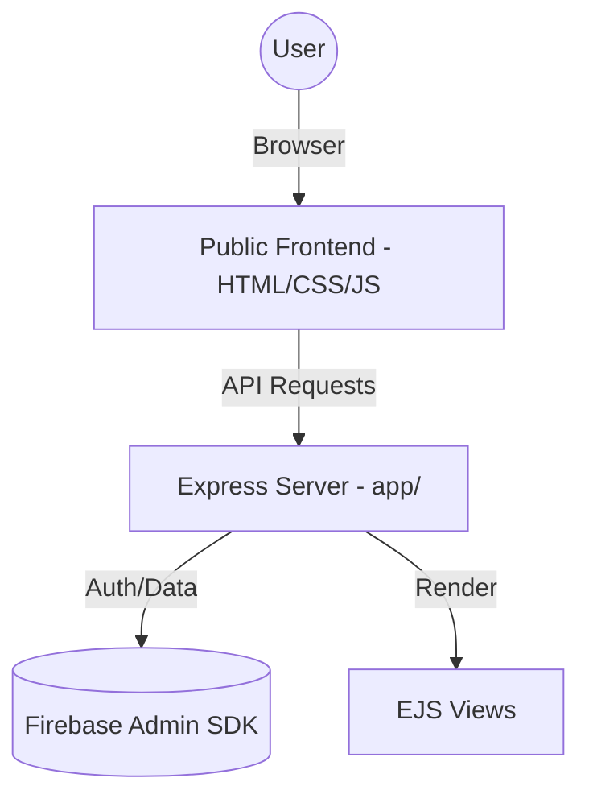

# FocusFun - Level Up Your Learning

FocusFun is a gamified study application designed to help students stay productive while making learning engaging. It combines a Pomodoro-style timer with RPG-like quest elements and social features.

## 🚀 Tech Stack

- **Frontend**: Vanilla HTML5, CSS3, JavaScript (ES6+), EJS Templates
- **Backend**: Node.js, Express.js
- **Database/Auth**: Firebase Admin SDK (Authentication & Real-time Database)
- **Deployment**: [Insert Live Link Here] (Supports HTTPS)

## ✨ Features

1.  **Gamified Study Timer**: A Pomodoro timer that rewards you with "experience points" and progress for every focused session.
2.  **Quest Game**: Test your knowledge after study sessions with interactive quizzes to earn rewards.
3.  **Social Challenges**: Invite friends and challenge them to study sessions or quiz battles.
4.  **Hall of Fame**: A global leaderboard to track the most dedicated learners in the community.
5.  **Personal Dashboard**: Track your study streaks, completed sessions, and quiz performance.

## 🛠️ Installation

1.  **Clone the repository**:
    ```bash
    git clone https://github.com/avaniobroi-lgtm/adhyasree.git
    cd adhyasree
    ```

2.  **Install dependencies**:
    ```bash
    npm install
    ```

3.  **Set up Environment Variables**:
    Create a `.env` file in the root directory (or use the one in `app/`) and add your Firebase credentials:
    ```env
    PORT=5000
    FIREBASE_PROJECT_ID=your-project-id
    # Add other firebase keys...
    ```

## 🏃 Running the App

- **Development Mode** (with auto-reload):
    ```bash
    npm run dev
    ```

- **Production Mode**:
    ```bash
    npm start
    ```

The app will be available at `http://localhost:5000`.

## 📸 Screenshots

> [!NOTE]
> Add your screenshots to the `docs/screenshots/` folder and update the links below.


## 📺 Demo Video
[Click here to watch the demo video](https://youtube.com/placeholder-demo-link)

## 🏗️ Architecture Diagram


*See more details in [docs/architecture.md](docs/architecture.md)*

## 📂 Project Structure

```text
adhyasree/
├── app/                # Backend logic (Controllers, Routes, Middleware)
├── public/             # Frontend assets (HTML, CSS, Client JS)
├── docs/               # Documentation and Diagrams
├── LICENSE             # Project License
├── package.json        # Dependencies and Scripts
└── README.md           # Project Overview
```

## 🔌 API Documentation

### Study Sessions
- `POST /api/study`: Create a new study session.
- `GET /api/study`: Get user study history.

### Quizzes
- `POST /api/quiz/result`: Save quiz results.
- `GET /api/quiz/leaderboard`: Fetch global rankings.

### Friends
- `GET /api/friends`: List all friends.
- `POST /api/friends/add`: Send friend request.
- `POST /api/friends/challenge`: Send a study challenge.

## 👥 Team Members

- **[Your Name]** - Lead Developer & Designer
- **[Member Name]** - [Role]

## 📜 License

This project is licensed under the MIT License - see the [LICENSE](LICENSE) file for details.

---
*Built with ❤️ during [Insert Event/Timeline Name]*
*AI Tools Used: Antigravity for code organization and documentation*
